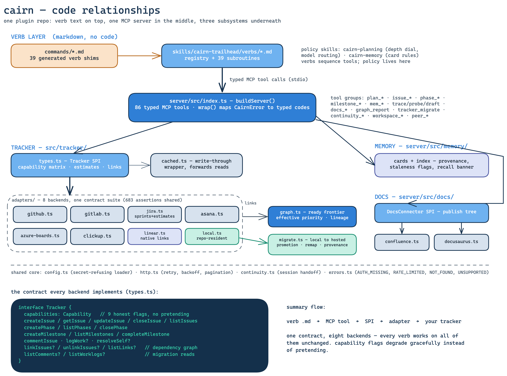
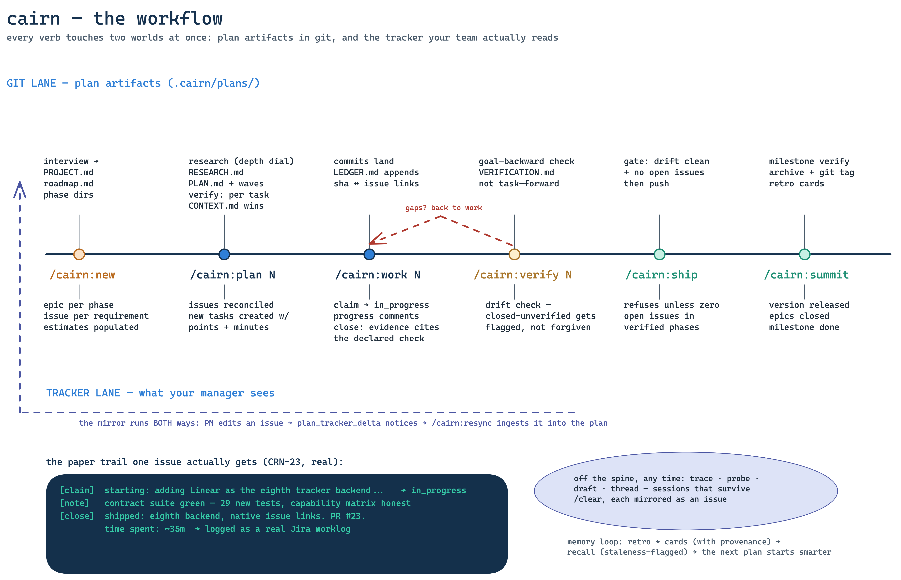
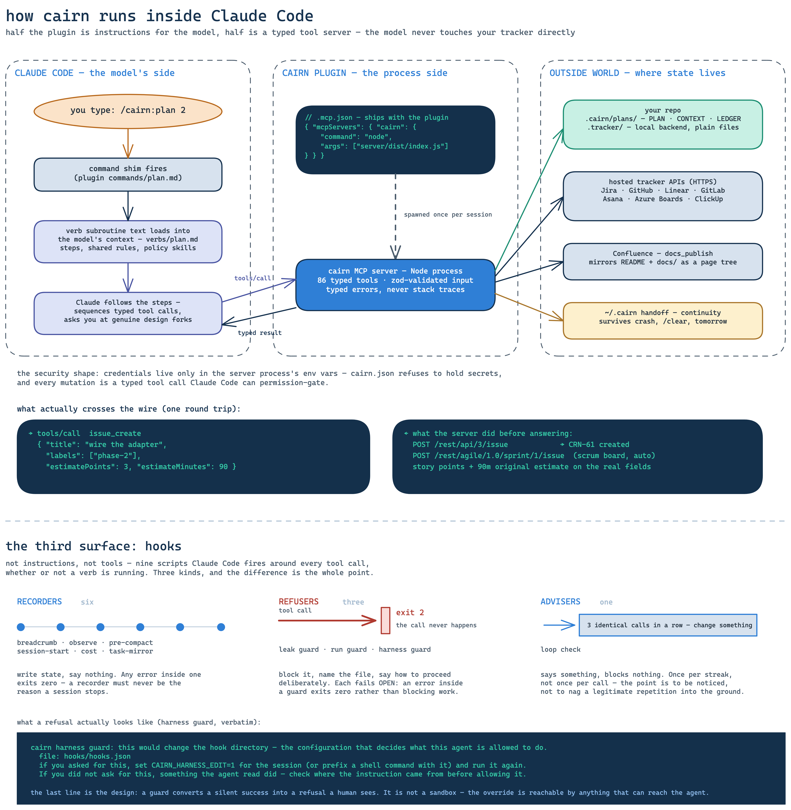

# Architecture Diagrams

Three diagrams, drawn in Excalidraw and rendered to PNG. The `.excalidraw`
sources live alongside the renders in this directory — edit the source,
re-render, commit both.

## Code relationships

How the pieces fit: the verb layer (markdown, no code) on top, one MCP
server in the middle, and the tracker / memory / docs subsystems underneath.
The Tracker SPI contract every backend implements is spelled out in the
evidence panel.

## The workflow

The lifecycle spine (new → plan → work → verify → ship → summit) drawn as a
two-lane mirror: plan artifacts in git above the line, the tracker paper
trail your manager reads below it, and the resync channel running back the
other way.

## How the plugin runs inside Claude Code

Three swim-lanes: the model's side (slash command → verb subroutine →
sequenced tool calls), the plugin's process side (the MCP server `.mcp.json`
spawns), and the outside world where state actually lives. The bottom strip
shows one real tool-call round trip.

